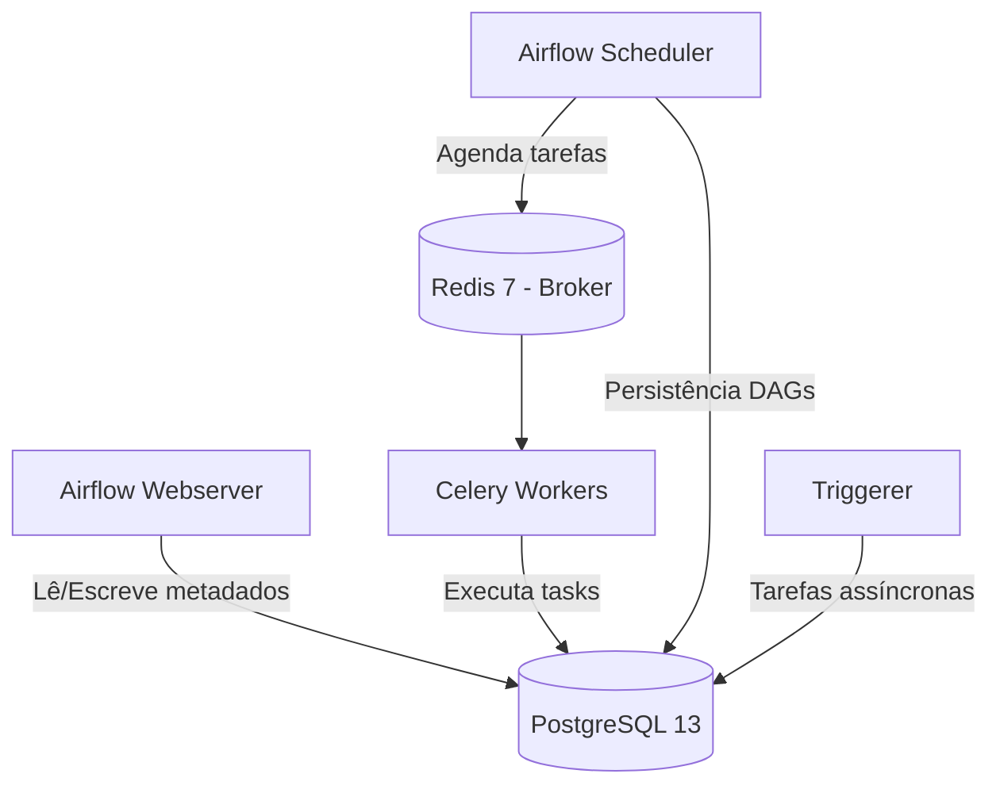
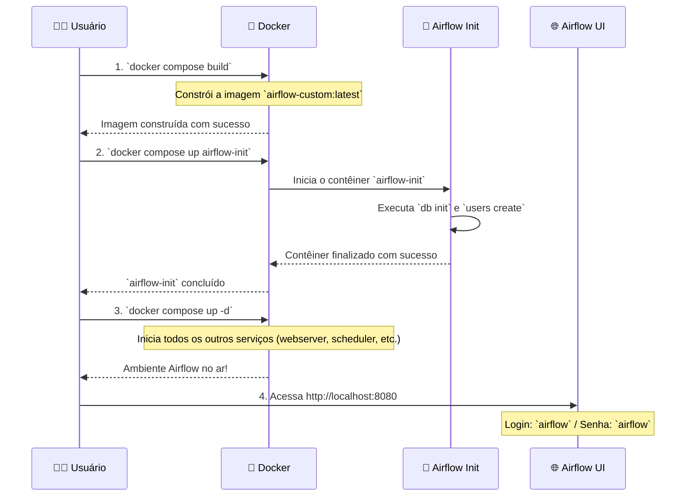

# 🚀 Projeto de Orquestração de Dados com Apache Airflow & Docker

---

## 🧭 Visão Geral do Projeto

Este projeto implementa um ambiente de orquestração de dados robusto e escalável, utilizando **Apache Airflow 2.9.1** em um ecossistema **Docker**. A arquitetura foi desenhada para refletir um ambiente de produção, empregando as melhores práticas de Engenharia de Dados para garantir segurança, performance e reprodutibilidade.

O core da solução é composto por:

-   🧩 **Stack Principal**: Apache Airflow (Webserver, Scheduler, Worker, Triggerer) orquestrado via Docker Compose.
-   ⚙️ **Executor Distribuído**: `CeleryExecutor` para processamento de tarefas em paralelo, garantindo alta disponibilidade e escalabilidade horizontal.
-   🗃️ **Metastore Confiável**: **PostgreSQL 13** como banco de dados de metadados, desacoplado e persistente.
-   ⚡ **Broker de Mensagens**: **Redis 7** como um broker leve e rápido para o Celery.
-   🔐 **Segurança**: Execução de contêineres com usuário **não-root** e gerenciamento de configurações via variáveis de ambiente.
-   🔄 **Inicialização Idempotente**: Um serviço `airflow-init` garante que o banco de dados seja migrado e o usuário administrador seja criado antes da inicialização dos serviços principais, evitando condições de corrida.

---

## 🗺️ Arquitetura da Solução

O diagrama abaixo ilustra a interação entre os componentes da nossa stack de orquestração de dados:



> **Por que o `CeleryExecutor` é a escolha ideal aqui?** Diferente do `LocalExecutor`, ele permite que os `workers` (executores de tarefas) rodem em máquinas separadas, escalando a capacidade de processamento de forma independente do `scheduler` e do `webserver`. Isso é fundamental para ambientes que processam um grande volume de dados ou que necessitam de alta disponibilidade.

---

## 🌟 Boas Práticas de Engenharia de Dados Aplicadas

| Prática | Implementação no Projeto | Justificativa Técnica (O "Porquê") |
| :--- | :--- | :--- |
| 🚀 **Executor Distribuído** | `AIRFLOW__CORE__EXECUTOR=CeleryExecutor` | Permite a **escalabilidade horizontal** dos workers, isolando a execução das tarefas dos serviços de agendamento e interface, o que aumenta a resiliência e o throughput. |
| 🗃️ **Metastore Externo e Robusto** | PostgreSQL 13 configurado via `AIRFLOW__DATABASE__SQL_ALCHEMY_CONN` | Garante a **confiabilidade e a consistência** dos metadados do Airflow, sendo a opção recomendada para ambientes de produção em detrimento do SQLite. |
| ⚡ **Broker de Mensagens Leve** | Redis 7 como broker para o Celery | Oferece uma **fila de mensagens rápida e de baixa latência**, ideal para a comunicação entre o scheduler e os workers do Celery. |
| 🔄 **Inicialização Idempotente** | Serviço `airflow-init` com `db init` e `users create` | **Elimina condições de corrida** durante a inicialização, garantindo que o banco de dados esteja sempre migrado e pronto antes que os outros serviços tentem se conectar. |
| ❤️ **Healthchecks Inteligentes** | Uso de `/health`, `pg_isready`, `redis-cli ping`, `airflow jobs check` | Orquestra a **ordem de inicialização correta** dos contêineres, facilita o diagnóstico de problemas e permite o autorreparo do ambiente. |
| 💾 **Persistência com Volumes Nomeados** | Logs, plugins e dados do DB em volumes Docker | **Desacopla o ciclo de vida dos dados** do ciclo de vida dos contêineres, garantindo a persistência e melhorando a performance de I/O, especialmente no Docker Desktop (Windows/macOS). |
| 📂 **Bind Mount Seletivo** | Apenas a pasta `dags/` é montada via bind mount | Permite a **iteração rápida no desenvolvimento de DAGs** (código "vivo") sem a penalidade de performance de I/O que ocorreria se todos os arquivos do Airflow fossem montados via bind. |
| 🔒 **Princípio do Menor Privilégio** | Contêineres rodam com usuário não-root (`user: "50000:0"`) | **Reduz a superfície de ataque** e evita problemas de permissão de arquivos entre o host e os contêineres. |
| 🔑 **Gerenciamento de Configurações** | Centralização de variáveis de ambiente em um arquivo `.env` | Alinha-se com a metodologia **12-Factor App**, mantendo as configurações (que variam entre ambientes) separadas do código e evitando que segredos sejam versionados. |
| 🧹 **Higiene de Build e Parsing** | Uso de `.dockerignore`, `.gitignore` e `AIRFLOW__CORE__DAG_IGNORE_FILE_REGEX` | Resulta em **builds de imagem mais rápidos e leves**, e um `scheduler` mais eficiente, que não perde tempo tentando parsear arquivos que não são DAGs. |

---

## 📂 Estrutura do Projeto

```bash
📦 projeto_airflow/
├── 🐳 docker-compose.yml      # Orquestra toda a stack de serviços
├── 🏗️ Dockerfile              # Define a imagem customizada (airflow-custom:latest)
├── 📋 requirements.txt        # Dependências Python para as DAGs e plugins
├── ⚙️ .env                    # Variáveis de ambiente (sensíveis ou específicas do ambiente)
├── 🚫 .dockerignore           # Arquivos a serem ignorados durante o build da imagem Docker
├── 🚫 .gitignore              # Arquivos a serem ignorados pelo Git
├──  DAGs/
│   ├── 📜 etl_pipeline.py     # Exemplo de DAG de ETL
│   ├── 📜 airflow_v1_Aula1.py
│   └── 📄 Tipo_de_transacao.csv # Dado de entrada para a DAG
└── 🔌 plugins/                # Plugins customizados do Airflow (persistidos em volume)
```

> 💡 **Otimização de Performance:** O `scheduler` é configurado para ignorar arquivos que não são DAGs, como notebooks Jupyter, checkpoints e caches do Python, através da variável `AIRFLOW__CORE__DAG_IGNORE_FILE_REGEX`. Isso acelera o tempo de parsing e evita erros acidentais.

---

## ▶️ Guia de Execução (Runbook)

O fluxo de inicialização do ambiente foi desenhado para ser sequencial e à prova de falhas. Siga os passos abaixo:



**Comandos para o Terminal:**

```bash
# 1. Construa a imagem customizada do Airflow
# Este comando lê o Dockerfile e o requirements.txt para criar a imagem com suas dependências.
docker compose build

# 2. Inicialize o banco de dados e crie o usuário admin
# Este passo é crucial e deve ser executado apenas uma vez por ambiente.
docker compose up airflow-init

# 3. Inicie todos os serviços do Airflow em background
docker compose up -d

# 4. Acesse a UI do Airflow
# Abra seu navegador e acesse: http://localhost:8080 (login: airflow / senha: airflow)

# 5. Verifique o status dos contêineres
docker compose ps

# 6. Acompanhe os logs de um serviço específico (ex: scheduler)
docker compose logs -f scheduler
```

---

## 🧪 DAG de Exemplo: `etl_pipeline.py`

Esta DAG demonstra um pipeline de ETL (Extração, Transformação e Carga) simples e robusto:

1.  **`load_file` (Extração)**: Lê o arquivo `Tipo_de_transacao.csv`. Implementa uma lógica de fallback para tentar diferentes delimitadores (`;` e `,`), tornando a extração mais resiliente a variações no formato do arquivo de entrada.
2.  **`transform_data` (Transformação)**: Renomeia colunas para nomes mais significativos (ex: `Tipo` para `Categoria`), filtra os dados para manter apenas as 10 categorias principais e salva o resultado em um novo arquivo CSV transformado.
3.  **`save_to_sqlite` (Carga)**: Carrega os dados transformados para uma tabela chamada `transacoes` em um banco de dados SQLite.

> **Por que o SQLite é salvo em `/opt/airflow/logs/data`?**
> Esta pasta corresponde a um **volume nomeado do Docker**, e não a um bind mount do sistema de arquivos do Windows. Isso **evita gargalos de I/O e problemas de permissão** que são comuns ao escrever arquivos a partir de contêineres Docker no Windows.

**Como acessar o banco de dados SQLite gerado:**

```powershell
# Execute este comando no PowerShell, na raiz do seu projeto
docker compose cp webserver:/opt/airflow/logs/data/meu_banco.db .\saida_data\
```

---

## 🧰 Integração com Ferramentas de BI e Dados

### Conectando o DBeaver ao Metastore (PostgreSQL)

1.  No DBeaver, vá em **Nova Conexão** e selecione **PostgreSQL**.
2.  Configure os parâmetros da conexão:
    *   **Host**: `localhost`
    *   **Porta**: `5432`
    *   **Banco de Dados**: `airflow`
    *   **Usuário**: `airflow`
    *   **Senha**: `airflow`
3.  Clique em **Testar Conexão** e, se tudo estiver correto, salve a conexão.

**Exemplos de Consultas SQL para Análise de Metadados:**

```sql
-- Listar todas as DAGs e seu status (pausada/ativa)
SELECT dag_id, is_paused, is_active, last_parsed_time
FROM dag
ORDER BY last_parsed_time DESC;

-- Analisar a performance de execução das DAGs
SELECT dag_id, COUNT(*) AS total_runs, AVG(EXTRACT(EPOCH FROM (end_date - start_date))) AS avg_duration_seconds
FROM dag_run
WHERE state = 'success'
GROUP BY dag_id
ORDER BY avg_duration_seconds DESC;
```

> 🔒 **Dica de Segurança para Produção:** Crie um usuário **read-only** no PostgreSQL e use-o para as conexões de ferramentas de BI, garantindo que elas não possam alterar os metadados do Airflow.

### Conectando o Power BI

#### Cenário A: Conectar ao Metastore do Airflow (PostgreSQL)

1.  No Power BI, clique em **Obter Dados** e selecione **Banco de dados PostgreSQL**.
2.  Insira as informações do servidor:
    *   **Servidor**: `localhost`
    *   **Banco de dados**: `airflow`
3.  Use as credenciais `airflow` / `airflow`.
4.  Selecione as tabelas de metadados que deseja analisar, como `dag`, `dag_run`, `task_instance`, e `log`.
5.  Crie relatórios para monitorar a saúde do seu ambiente Airflow, como a taxa de sucesso de DAGs, o tempo médio de execução e as tarefas que mais falham.

#### Cenário B: Conectar ao Banco de Dados SQLite (saída da DAG) via ODBC

1.  **Instale o Driver ODBC do SQLite** para Windows (64-bit).
2.  Abra as **Fontes de Dados ODBC (64-bit)** no Windows e vá para a aba **DSN de Sistema**.
3.  Clique em **Adicionar**, selecione o **SQLite3 ODBC Driver** e configure o DSN para apontar para o arquivo `meu_banco.db` que você copiou para a pasta `saida_data`.
4.  No Power BI, clique em **Obter Dados** e selecione **ODBC**. Escolha o DSN que você acabou de criar e importe a tabela `transacoes`.

> 🔄 **Mantenha seus dados atualizados:** Sempre que a DAG for reprocessada, execute novamente o comando `docker compose cp ...` e clique em **Atualizar** no Power BI para carregar os novos dados.

---

## 🩺 Guia de Troubleshooting

-   **Erro de `mount` no Docker Desktop (Windows)**: `mkdir /run/desktop/mnt/host/c: file exists`
    *   **Causa**: Problemas de I/O com bind mounts no Windows.
    *   **Solução**: A arquitetura deste projeto já mitiga isso, usando bind mount **apenas para a pasta `dags/`** e volumes nomeados para todo o resto (logs, plugins, DB).

-   **Erro de encoding no arquivo `.env`**
    *   **Causa**: O arquivo `.env` foi salvo com uma codificação incorreta (ex: UTF-8 com BOM).
    *   **Solução**: Salve o arquivo `.env` com a codificação **UTF-8**. No VSCode, use a opção *Salvar com Codificação*.

-   **Airflow continua pedindo `airflow db init`**
    *   **Causa**: O serviço `airflow-init` não foi executado ou falhou.
    *   **Solução**: Sempre siga o runbook: execute `docker compose up airflow-init` **antes** de `docker compose up -d`.

-   **Minha DAG não aparece na UI**
    *   **Causa**: O arquivo da DAG não está na pasta `dags/`, possui um erro de sintaxe, ou está sendo ignorado.
    *   **Solução**: Verifique o caminho do arquivo, a sintaxe Python e os logs do `scheduler` (`docker compose logs -f scheduler`) para encontrar erros de parsing.

---

## 🏁 Conclusão

Este projeto não é apenas uma configuração funcional do Apache Airflow, mas uma demonstração de **domínio técnico em Engenharia de Dados**. Ele evidencia a capacidade de construir pipelines de dados **seguros, escaláveis e reprodutíveis**, utilizando as ferramentas e práticas mais modernas do mercado. A arquitetura foi pensada para ser resiliente e performática, pronta para desafios de orquestração de dados em ambientes complexos.


